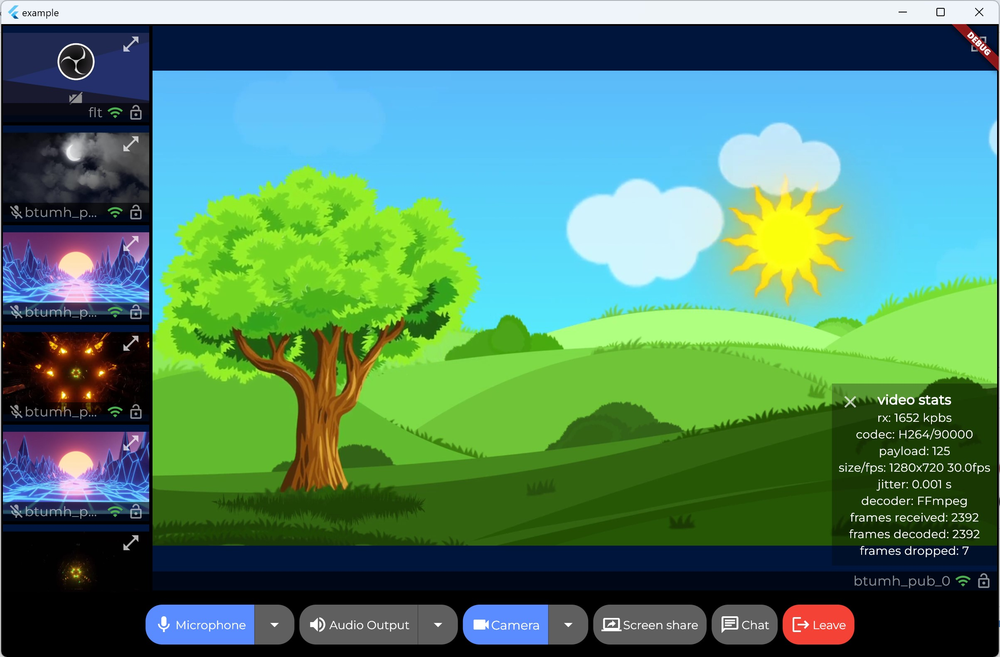

<!--BEGIN_BANNER_IMAGE-->

<picture>
  <source media="(prefers-color-scheme: dark)" srcset="/.github/banner_dark.png">
  <source media="(prefers-color-scheme: light)" srcset="/.github/banner_light.png">
  
</picture>

<!--END_BANNER_IMAGE-->

[](https://pub.dev/packages/livekit_components)

# Flutter Components

<!--BEGIN_DESCRIPTION-->
Use this SDK to add realtime video, audio and data features to your Flutter app. By connecting to <a href="https://livekit.io/">LiveKit</a> Cloud or a self-hosted server, you can quickly build applications such as multi-modal AI, live streaming, or video calls with just a few lines of code.
<!--END_DESCRIPTION-->




## Introduction

LiveKit component state management is based on [provider](https://pub.dev/packages/provider), please refer to the [flowchart](./flowchart.md) for the widgets rendering tree.

## Installation

Add the following to your `pubspec.yaml`:

```yaml
dependencies:
  livekit_components: ^1.0.0
```

Then run `flutter pub get`.

and follow this docs to configure your project for [iOS](https://github.com/livekit/client-sdk-flutter#ios) and [Android](https://github.com/livekit/client-sdk-flutter#android).

## Usage

Here is a simple example of how to use the components in your Flutter app:

```dart
import 'package:flutter/material.dart';
import 'package:livekit_components/livekit_components.dart';

void main() {
  runApp(const MyApp());
}

class MyApp extends StatelessWidget {
  const MyApp({super.key});

  @override
  Widget build(BuildContext context) {
    return LivekitRoom(
      roomContext: RoomContext(
        url: 'your room url',
        token: 'your room token',
        connect: true,
      ),
      builder: (context, roomCtx) {
        return MaterialApp(
          theme: LiveKitTheme().buildThemeData(context),
          home: Scaffold(
            appBar: AppBar(
              title: const Text('LiveKit Components Sample'),
            ),
            body: Center(
              child: Column(
                mainAxisAlignment: MainAxisAlignment.center,
                children: <Widget>[
                  Expanded(
                    /// show participant loop
                    child: ParticipantLoop(
                      showAudioTracks: false,
                      showVideoTracks: true,

                      /// layout builder
                      layoutBuilder: const GridLayoutBuilder(),

                      /// participant builder
                      participantBuilder: (context) {
                        /// build participant widget for each Track
                        /// return ParticipantTileWidget for each participant
                        /// you can customize the widget as you want, please refer to the example
                        /// https://github.com/livekit/components-flutter/blob/main/example/lib/main.dart#L130-L168
                        return const ParticipantTileWidget();
                      },
                    ),
                  ),

                  /// show control bar at the bottom
                  const ControlBar(),
                ],
              ),
            ),
          ),
        );
      },
    );
  }
}
```

## Example

You can find a complete example in the [example](./example) folder.

<!--BEGIN_REPO_NAV-->
<br/><table>
<thead><tr><th colspan="2">LiveKit Ecosystem</th></tr></thead>
<tbody>
<tr><td>LiveKit SDKs</td><td><a href="https://github.com/livekit/client-sdk-js">Browser</a> · <a href="https://github.com/livekit/client-sdk-swift">iOS/macOS/visionOS</a> · <a href="https://github.com/livekit/client-sdk-android">Android</a> · <a href="https://github.com/livekit/client-sdk-flutter">Flutter</a> · <a href="https://github.com/livekit/client-sdk-react-native">React Native</a> · <a href="https://github.com/livekit/rust-sdks">Rust</a> · <a href="https://github.com/livekit/node-sdks">Node.js</a> · <a href="https://github.com/livekit/python-sdks">Python</a> · <a href="https://github.com/livekit/client-sdk-unity">Unity</a> · <a href="https://github.com/livekit/client-sdk-unity-web">Unity (WebGL)</a></td></tr><tr></tr>
<tr><td>Server APIs</td><td><a href="https://github.com/livekit/node-sdks">Node.js</a> · <a href="https://github.com/livekit/server-sdk-go">Golang</a> · <a href="https://github.com/livekit/server-sdk-ruby">Ruby</a> · <a href="https://github.com/livekit/server-sdk-kotlin">Java/Kotlin</a> · <a href="https://github.com/livekit/python-sdks">Python</a> · <a href="https://github.com/livekit/rust-sdks">Rust</a> · <a href="https://github.com/agence104/livekit-server-sdk-php">PHP (community)</a> · <a href="https://github.com/pabloFuente/livekit-server-sdk-dotnet">.NET (community)</a></td></tr><tr></tr>
<tr><td>UI Components</td><td><a href="https://github.com/livekit/components-js">React</a> · <a href="https://github.com/livekit/components-android">Android Compose</a> · <a href="https://github.com/livekit/components-swift">SwiftUI</a></td></tr><tr></tr>
<tr><td>Agents Frameworks</td><td><a href="https://github.com/livekit/agents">Python</a> · <a href="https://github.com/livekit/agents-js">Node.js</a> · <a href="https://github.com/livekit/agent-playground">Playground</a></td></tr><tr></tr>
<tr><td>Services</td><td><a href="https://github.com/livekit/livekit">LiveKit server</a> · <a href="https://github.com/livekit/egress">Egress</a> · <a href="https://github.com/livekit/ingress">Ingress</a> · <a href="https://github.com/livekit/sip">SIP</a></td></tr><tr></tr>
<tr><td>Resources</td><td><a href="https://docs.livekit.io">Docs</a> · <a href="https://github.com/livekit-examples">Example apps</a> · <a href="https://livekit.io/cloud">Cloud</a> · <a href="https://docs.livekit.io/home/self-hosting/deployment">Self-hosting</a> · <a href="https://github.com/livekit/livekit-cli">CLI</a></td></tr>
</tbody>
</table>
<!--END_REPO_NAV-->
