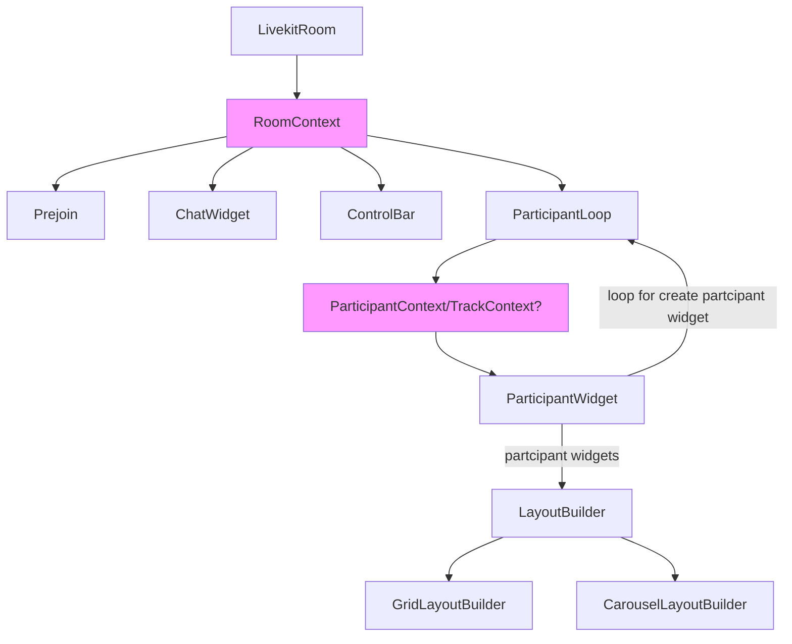
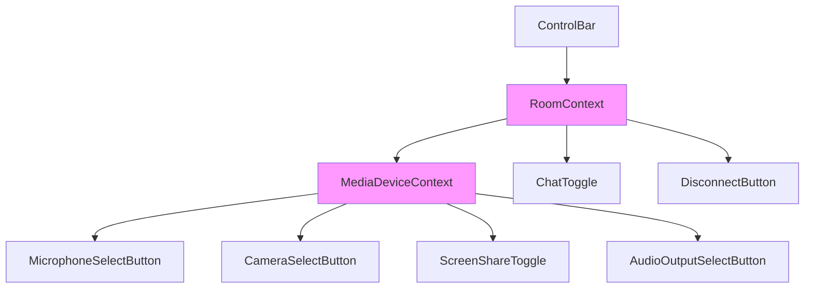
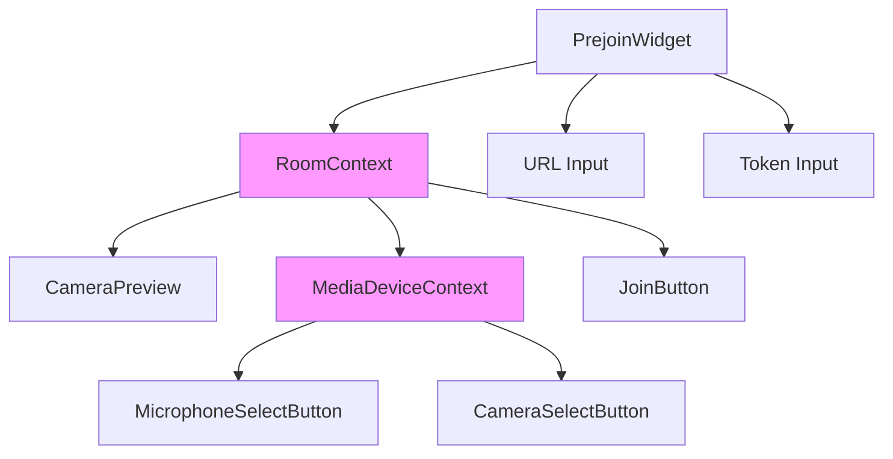
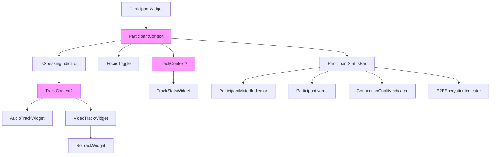

# Flowchart for widgets rendering tree

## Rendering tree for LivekitRoom

```mermaid
flowchart TD
    A[LivekitRoom] --> B[RoomContext]
    style B fill:#f9f
    B --> D0[Prejoin]
    B --> D1[ChatWidget]
    B --> D2[ControlBar]
    B --> C1[ParticipantLoop]
    C1 --> C2[ParticipantContext/TrackContext?]
    style C2 fill:#f9f
    C2 --> H[ParticipantWidget]
    H --> |loop for create partcipant widget| C1
    H --> |partcipant widgets| I[LayoutBuilder]
    I --> J[GridLayoutBuilder]
    I --> K[CarouselLayoutBuilder]
```

## Rendering tree for ControlBar

```mermaid
flowchart TD
A[ControlBar] --> B[RoomContext]
style B fill:#f9f
B --> D[MediaDeviceContext]
style D fill:#f9f
D --> E1[MicrophoneSelectButton]
D --> E2[CameraSelectButton]
D --> E3[ScreenShareToggle]
D --> E4[AudioOutputSelectButton]

B --> C2[ChatToggle]
B --> C1[DisconnectButton]
```

## Rendering tree for Prejoin

```mermaid
flowchart TD
A[PrejoinWidget] --> B[RoomContext]
style B fill:#f9f
B --> C[CameraPreview]
B --> D[MediaDeviceContext]
style D fill:#f9f
D --> E[MicrophoneSelectButton]
D --> F[CameraSelectButton]

A --> G1[URL Input]
A --> G2[Token Input]
B --> G3[JoinButton]
```

## Rendering tree for Particpant

```mermaid
flowchart TD
A[ParticipantWidget] --> B[ParticipantContext]
style B fill:#f9f
B --> C[IsSpeakingIndicator]
C --> C1[TrackContext?]
style C1 fill:#f9f
C1 --> D1[AudioTrackWidget]
C1 --> D2[VideoTrackWidget]
B --> D3[FocusToggle]
B --> B1[TrackContext?]
style B1 fill:#f9f
B1 --> D4[TrackStatsWidget]
B --> D5[ParticipantStatusBar]
D2 --> F[NoTrackWidget]
D5 --> G1[ParticipantMutedIndicator]
D5 --> G2[ParticipantName]
D5 --> G3[ConnectionQualityIndicator]
D5 --> G4[E2EEncryptionIndicator]
```
